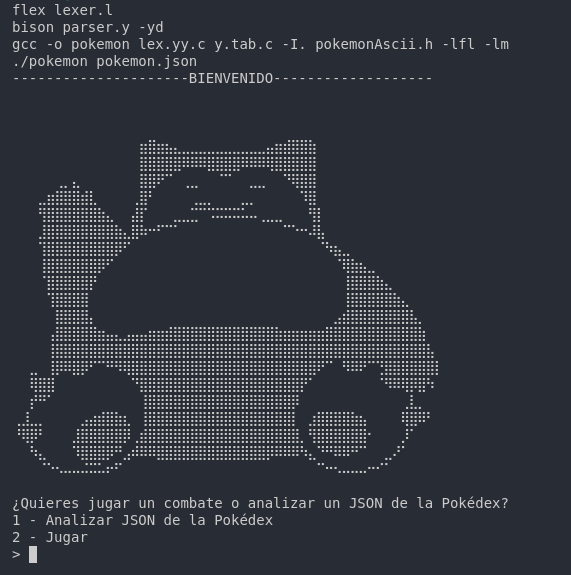
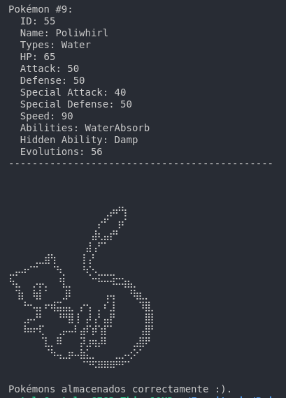
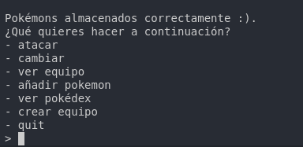
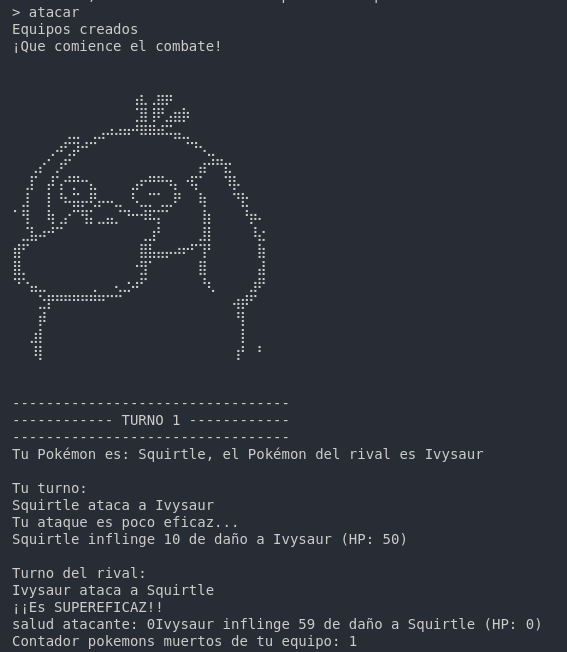
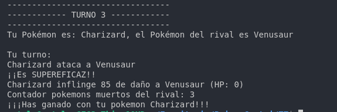
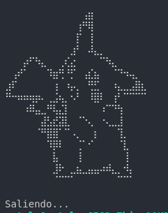

# Análisis de datos de Pokémon y simulación de combates


Este proyecto permite analizar un archivo JSON de Pokemon y simular un combate paso a paso. En este archivo se muestran algunos ejemplos del programa:

## Ejecución

Para iniciar la aplicación simplemente usa:

```
make
```

Se mostrará lo siguiente:



## Análisis del archivo JSON

Si eliges esta opción se analizará el archivo JSON de Pokémon presente en el proyecto y se almacenarán los Pokémons.



## Combate en ejecución

Si decidimos `jugar` analizará este JSON automáticamente y nos mostrará el siguiente menú de opciones. Ahora mismo solo podremos ver nuestro equipo, añadir un nuevo Pokémon, crear un equipo y salir del programa.




## Si decidimos iniciar el combate con `atacar`, nos creará un equipo de manera automática si no lo hemos hecho e iniciará el combate.

A continuación se muestran dos imágenes del combate:





## Salida de la aplicación

Si elegimos la opción `quit` nos mostrará lo siguiente:

